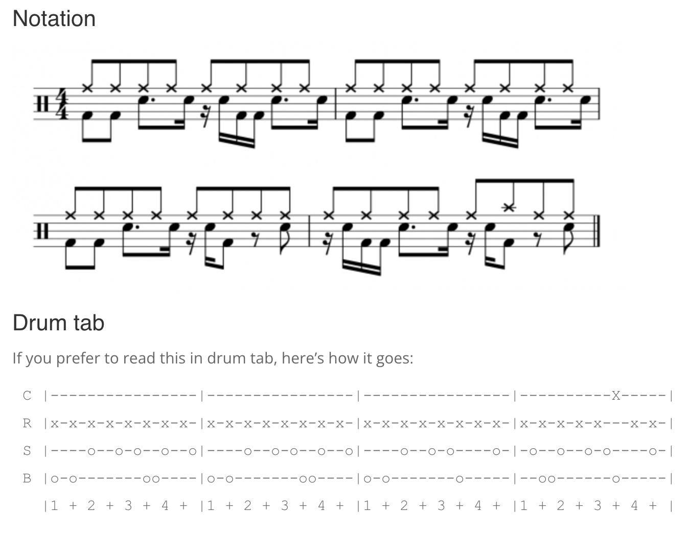

# Daisy Pod Drum Machine

## Author

Kai Wang

## Description

This project implements a versatile drum machine on the Daisy Pod platform. It features multiple drum sets with different sonic characteristics, a metronome, and a preset rhythm sequencer. The system allows real-time control of tempo, volume, and drum selection through the Pod's interface.

## Audio Processing Features

### Core Components
1. **Kick Drum**: Sine oscillator with percussive envelope
2. **Snare Drum**: Bandpass-filtered white noise with percussive envelope
3. **Hi-Hat**: Highpass-filtered white noise with short decay
4. **Metronome**: High-frequency sine wave with short envelope
5. **Preset Sequencer**: 64-step rhythm patterns for automatic playback

### Technical Specifications
- **Sample Rate**: 48 kHz
- **Tempo Range**: 60 BPM to 180 BPM
- **Drum Sets**: 6 different configurations
- **Preset Length**: 64 steps (4 bars of 16th notes)
- **Audio Latency**: ~1ms (48-sample blocks)

## Control Interface

### Knob 1 - Tempo Control
- **Function**: Sets the playback tempo
- **Range**: 60 BPM to 180 BPM
- **Position**: Fully counter-clockwise = 60 BPM, fully clockwise = 180 BPM

### Knob 2 - Volume Control
- **Function**: Adjusts master volume
- **Range**: 0% to 100%
- **Position**: Fully counter-clockwise = silent, fully clockwise = maximum volume

### Encoder - Drum Set Selection
- **Function**: Cycles through available drum sets
- **Operation**: Turn clockwise/counter-clockwise to change drum sets
- **Effect**: Changes the sonic characteristics of all drums

### Encoder Button - Preset Mode Toggle
- **Function**: Switches between manual and preset playback modes
- **Operation**: Press to toggle modes
- **Effect**: 
  - Manual Mode: Direct control of drums via buttons
  - Preset Mode: Automatic playback of rhythm patterns

### Button 1 - Kick Drum Trigger
- **Function**: Triggers kick drum in manual mode
- **Operation**: Press to play kick drum
- **Effect**: Plays kick drum with current drum set parameters

### Button 2 - Snare Drum Trigger
- **Function**: Triggers snare drum in manual mode
- **Operation**: Press to play snare drum
- **Effect**: Plays snare drum with current drum set parameters

## LED Status Indicators

### Normal Operation
- **LED1**: Color indicates current drum set
  - Red: Classic Kit
  - Green: Electronic Kit
  - Blue: 808 Style Kit
  - Yellow: Rock Kit
  - Magenta: Lo-Fi HipHop Kit
  - Cyan: Industrial Kit

### Preset Mode
- **LED1**: White
- **Indicates**: Preset playback mode is active

## Drum Set Configurations

### Classic Kit
- Kick: 60Hz, 0.20s decay
- Snare: 1800Hz filter, 0.15s decay
- Hi-Hat: 12000Hz filter, 0.05s decay

### Electronic Kit
- Kick: 80Hz, 0.12s decay
- Snare: 1200Hz filter, 0.10s decay
- Hi-Hat: 10000Hz filter, 0.04s decay

### 808 Style Kit
- Kick: 45Hz, 0.80s decay
- Snare: 2200Hz filter, 0.10s decay
- Hi-Hat: 8000Hz filter, 0.06s decay

### Rock Kit
- Kick: 55Hz, 0.28s decay
- Snare: 2500Hz filter, 0.18s decay
- Hi-Hat: 11000Hz filter, 0.05s decay

### Lo-Fi HipHop Kit
- Kick: 70Hz, 0.15s decay
- Snare: 1000Hz filter, 0.09s decay
- Hi-Hat: 9000Hz filter, 0.07s decay

### Industrial Kit
- Kick: 65Hz, 0.10s decay
- Snare: 3500Hz filter, 0.12s decay
- Hi-Hat: 7000Hz filter, 0.03s decay

## Usage Examples

### Basic Drumming
1. Select desired drum set using encoder
2. Set tempo with Knob 1
3. Adjust volume with Knob 2
4. Play drums using Buttons 1 and 2

### Preset Playback
1. Press encoder button to enter preset mode
2. Press Button 1 to start playback
3. Adjust tempo and volume as desired
4. Press encoder button again to return to manual mode

## Preset Rhythm Pattern: The Amen Break

The preset rhythm pattern implemented in this drum machine is based on the famous "Amen Break" - one of the most sampled and influential drum breaks in music history. Originally recorded in 1969 by The Winstons' drummer G.C. Coleman, this 4-bar pattern has become a cornerstone of electronic music, particularly in genres like hip-hop, jungle, and drum & bass.

The pattern features:
- A distinctive syncopated rhythm
- Complex hi-hat patterns
- Dynamic snare hits
- Powerful kick drum accents

This implementation preserves the essential character of the original break while allowing for:
- Tempo adjustment (60-180 BPM)
- Different drum set timbres
- Volume control
- Metronome synchronization

For more information about the Amen Break, visit: [Elephant Drums - The Amen Break](https://www.elephantdrums.co.uk/blog/guides-and-resources/amen-break-drum-groove/)

